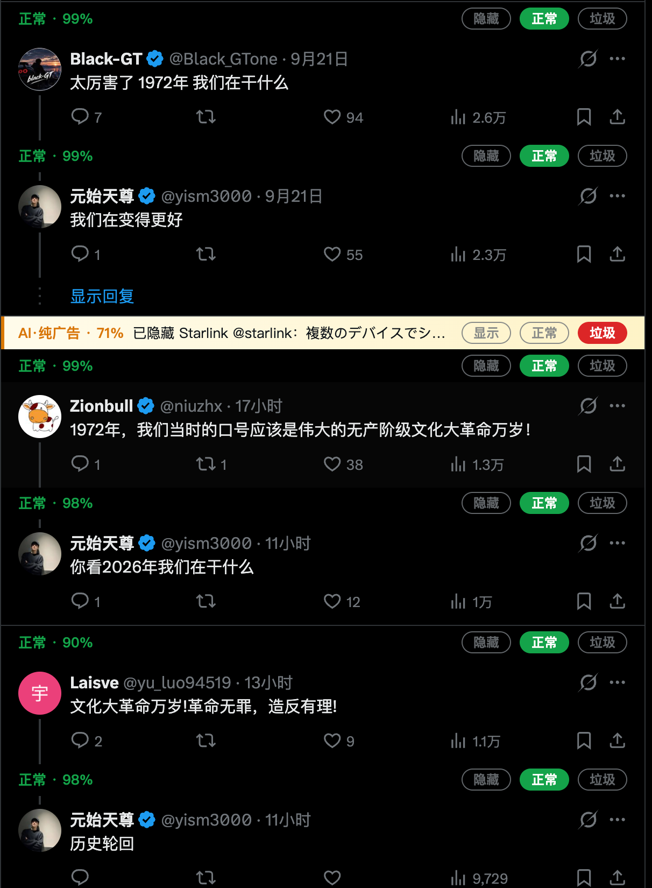
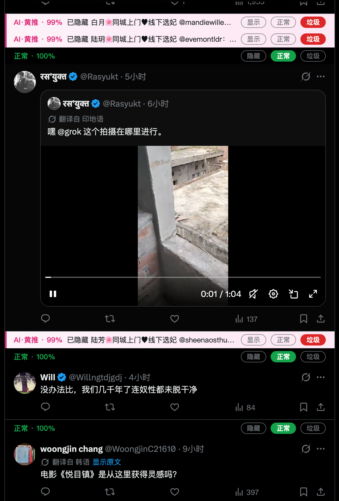
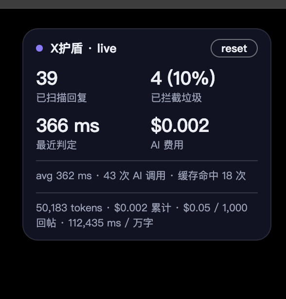
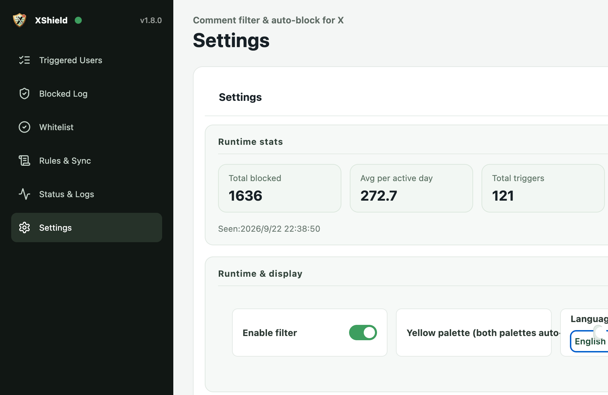

# 发布操作说明（本节不要发）

**发推步骤**：复制下方「正文」区全部内容 → 按顺序上传 4 张配图 → 发送（长文需 X Premium）。

**配图清单**（本目录 `promo/` 下，GitHub 页面有内嵌预览）：

| 顺序 | 文件 | 内容 |
|---|---|---|
| 图1 | `promo/1-status-bars.png` | 评论区状态条全景（正常绿 / AI·黄推粉 / 可疑琥珀） |
| 图2 | `promo/2-auto-collapsed.png` | 垃圾回复自动收起后的状态条（AI·黄推 · 99%） |
| 图3 | `promo/3-live-hud.png` | 右上角 live 状态框（扫描/拦截/延迟/AI 费用） |
| 图4 | `promo/4-en-settings.png` | 英文界面总设置（AI 引擎区） |

配图内嵌预览：

---

# 正文（从这里开始复制）

我的 X 评论区终于干净了 —— 我给 X 做了一个开源的 AI 反垃圾浏览器扩展：X护盾 🛡

先说效果（图1）：
每条回复头顶都有一条实时状态条 ——
🟢 正常 · 96%（放行）
🔴 AI·黄推 · 99%（自动隐藏）
🟡 可疑 · 39%（等你裁决）

它不是关键词屏蔽器。它接入了 TypeSafe 的 System One 判定模型（Jev）：
每次扫到新回复，一次 API 调用并行回答三个问题——
① 这条属于哪类：黄推 / 诈骗 / 纯广告 / 人机 / 正常
② 垃圾程度打分（0–3）
③ 是不是垃圾（概率）

三个信号 + 你自己的词库命中情况，综合成三档结果。
词库命中是人工维护的真值 —— 模型犹豫时，听词库的。

【图1：评论区状态条全景】

最关键的设计：判定过程全程可见，隐藏延迟到你看过。
命中后先淡粉标记，保持可见约 1.5 秒；
你的视线扫过去之后，它自动收起为一行状态条。
收起的不是黑箱：状态条上写着「AI·黄推 · 99% 已隐藏 @某某：原文摘要」。

【图2：收起状态条特写】

误判了？状态条上直接点：
「正常」= 撤回隐藏 + 退出待拉黑 + 本会话不再判定该作者；
「垃圾」= 确认进拉黑队列。
更重要的是——你的每次人工确认都会被系统学习：
自动提取这条内容的特征词进词库，下次同类话术秒触发，连 AI 都不用等。

右上角有一块 live 状态框（见图3）：
已扫描回复数、拦截数（含占比）、最近判定延迟、AI 费用（$ 实时累计）、
tokens 总数、每 1,000 条成本、平均每万字耗时 —— 全透明。

【图3：live 状态框】

费用透明到分：官方定价 $42/Btok（仅输入计费，输出免费）。
实测每 1,000 条回帖 ≈ $0.05，缓存命中不计费，关键字层触发零成本。

隐私是底线：
API Key 只存本地，判定请求由扩展后台直发 TypeSafe；
词库、记录、拉黑列表全部本地；
无遥测、无账号体系、开源可审计。

英文用户也照顾到了：内置 100+ 条英文垃圾模式
（OnlyFans 导流、crypto giveaway、seed phrase 钓鱼、f4f、cash flip、
betting tips、free robux、join my telegram……），中英文同样即时触发。

【图4：英文界面设置页】

默认设置就是最保守的「仅隐藏」：只隐藏+记录，绝不自动拉黑。
想要自动拉黑，打开对应开关，队列按类人节奏执行（每日上限+随机间隔）。

开源 + 免费：https://github.com/smthdagg/XShield
安装包在 Release 页，解压即用。

#AI #OpenSource #Chrome扩展 #Twitter

---

# English version（英文受众单独发）

My X replies are finally clean — I built an open-source AI anti-spam extension for X: XShield 🛡

Every reply gets a live status bar (图1):
🟢 Normal · 96% → pass
🔴 AI·Porn-bait · 99% → auto-hidden
🟡 Suspicious · 39% → waits for your call

It's not a keyword blocker. It calls TypeSafe's System One model (Jev):
one API call answers three questions in parallel —
category (porn-bait / scam / pure ads / bot / normal), severity score (0–3),
and an is-spam probability — combined with your own curated blocklist
(keyword hits override model hesitation).

The key design: the whole process is visible, and hiding waits until you've seen it.
Hits stay marked for ~1.5 s, then collapse into one status bar —
"AI·Porn-bait · 99% hidden @user: text…" with Show / Normal / Spam buttons.

Misclick? One tap:
Normal → unhide + leave the block queue + stop judging that author this session;
Spam → confirm + queue for blocking.
And the system learns: every confirmation extracts keyword features into your blocklist —
next time the same script triggers instantly, no AI call needed.

A live HUD shows scans, caught (with %), latency, and running AI cost —
official pricing $42/Btok (input only, output free) ≈ $0.05 per 1,000 replies.

English users are covered: 100+ English spam patterns ship out of the box
(OnlyFans bait, crypto giveaways, seed-phrase phishing, f4f, cash flips,
betting tips, free robux, join my telegram…).

Defaults are the most conservative: hide-only, never auto-block —
flip the switches if you want the auto-block queue (human-paced).

Open source + free: https://github.com/smthdagg/XShield

#AIAgents #OpenSource #Chrome #SpamFilter
