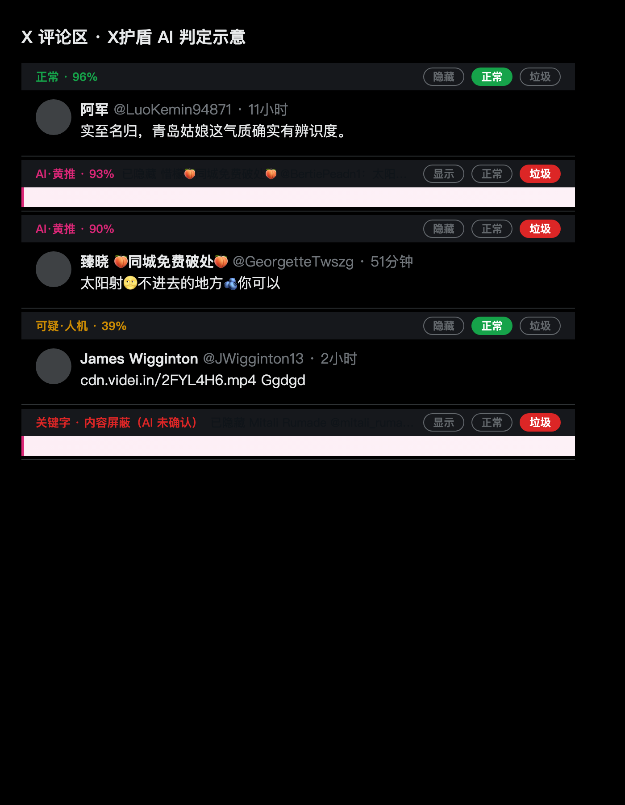
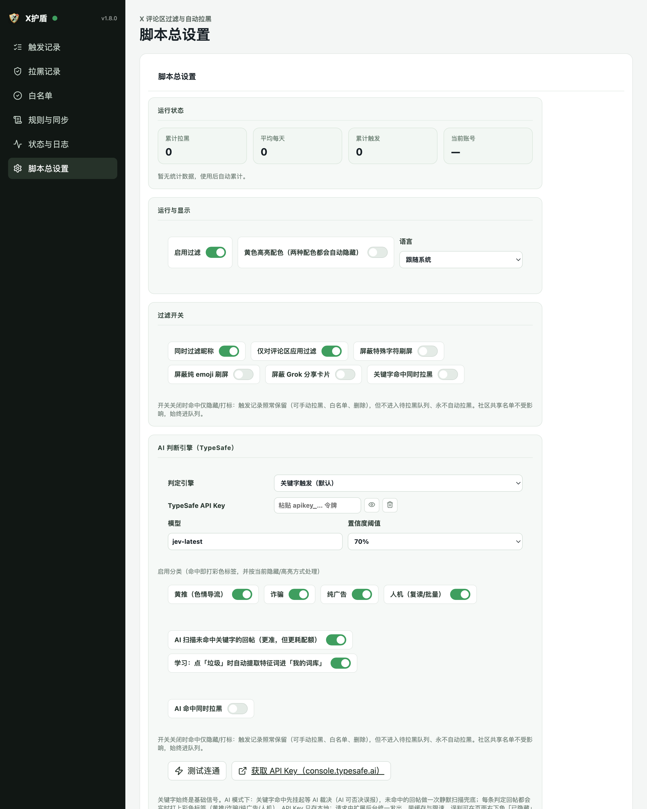
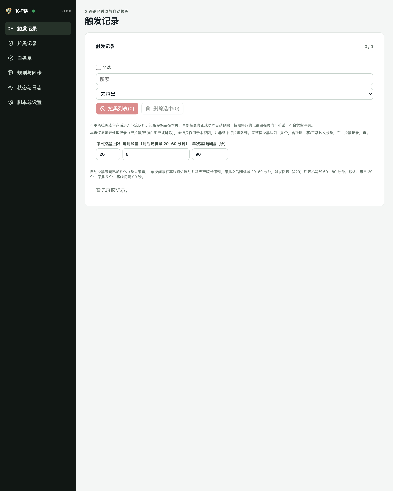
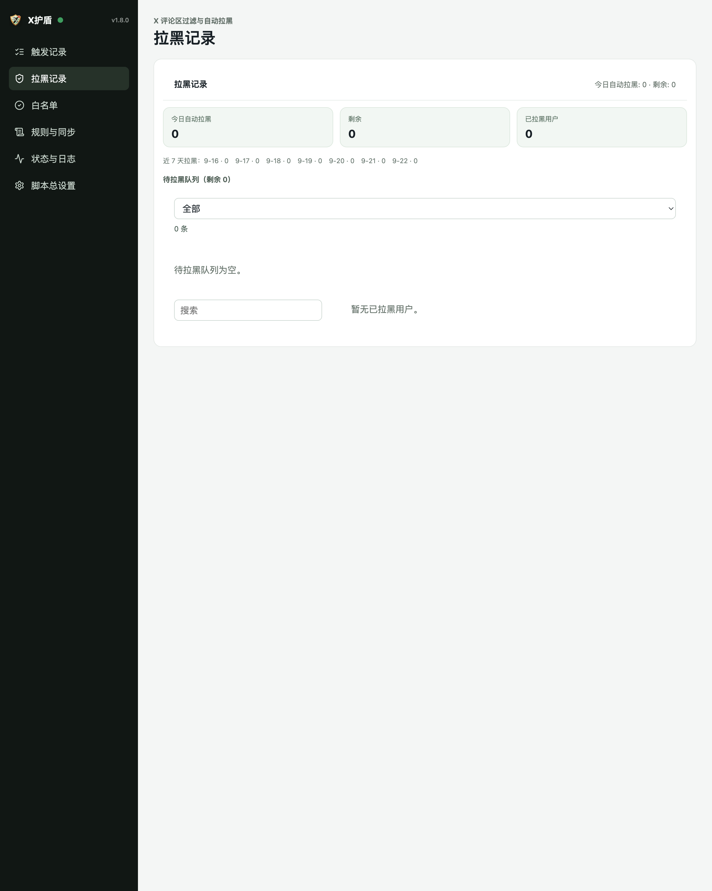
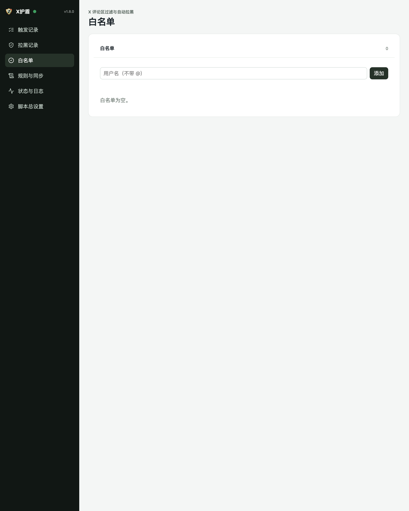
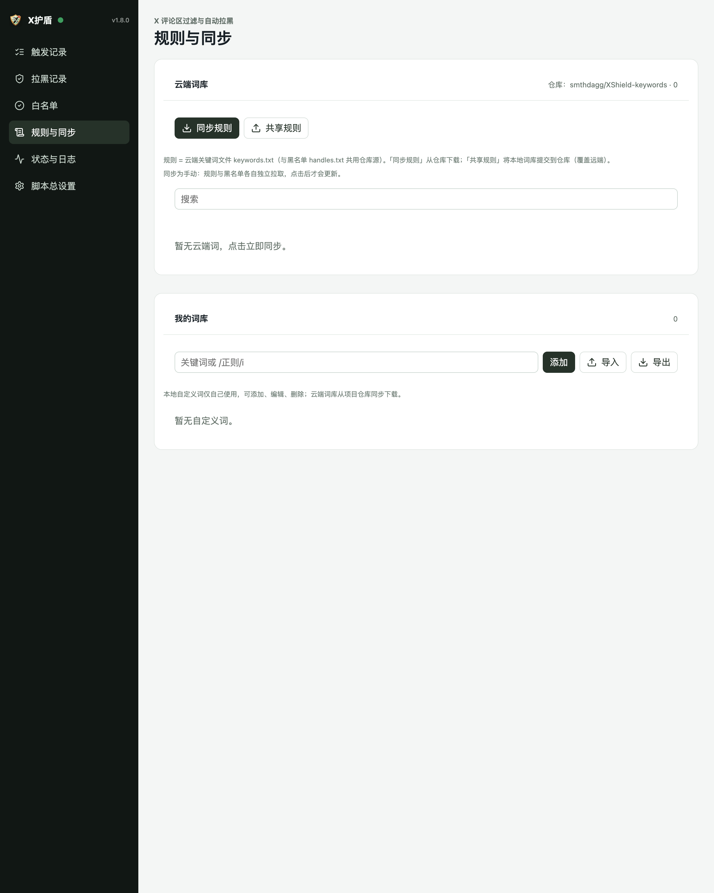
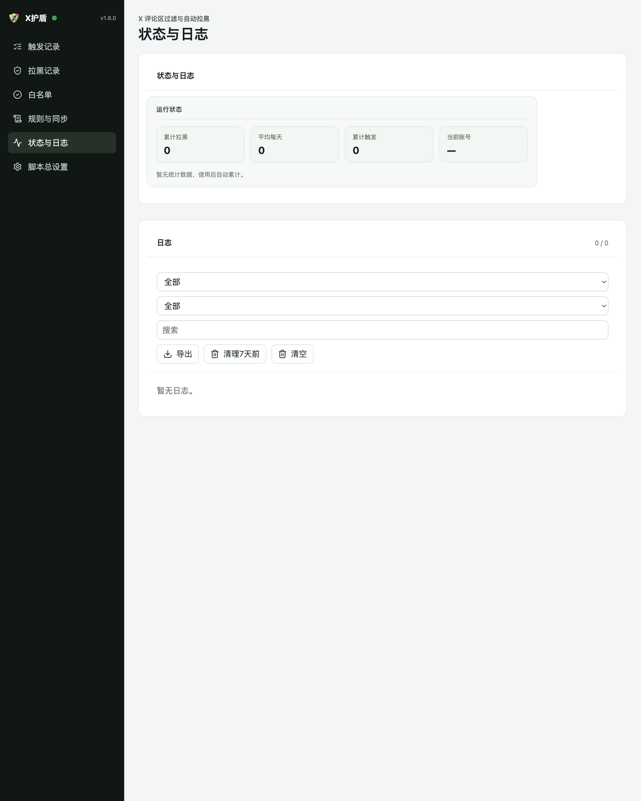

# X护盾（XShield）图文使用教程

> 适用版本 v1.8.0 · 配套面板截图均为实际界面

---

## 目录

1. [这是什么](#1-这是什么)
2. [安装](#2-安装)
3. [五分钟上手](#3-五分钟上手)
4. [浏览时的触发过程](#4-浏览时的触发过程核心)
5. [开启 AI 判断引擎](#5-开启-ai-判断引擎)
6. [命中处理：仅隐藏 vs 同时拉黑](#6-命中处理仅隐藏-vs-同时拉黑)
7. [误判恢复与人工纠错](#7-误判恢复与人工纠错)
8. [学习回路：越用越准](#8-学习回路越用越准)
9. [费用：花了多少钱一目了然](#9-费用花了多少钱一目了然)
10. [管理面板六页详解](#10-管理面板六页详解)
11. [自动拉黑节奏](#11-自动拉黑节奏)
12. [隐私](#12-隐私)
13. [常见问题 FAQ](#13-常见问题-faq)
14. [故障排查](#14-故障排查)

---

## 1. 这是什么

你在 X（Twitter）评论区总会遇到**黄推、诈骗、纯广告、人机**四类垃圾账号。X护盾做三件事：

1. **看**：浏览评论区时自动扫描每条回复，命中关键字或被 AI 判定为垃圾的内容会被标记；
2. **藏**：标记的回复先保持可见约 1.5 秒（让你看到判定过程），然后自动收起为一行状态条；
3. **记**：垃圾账号写入触发记录，按你选择的模式决定是否进入待拉黑队列。

所有数据只存在你的浏览器本地；AI 判定需要你自己配置 API Key（可选功能）。

---

## 2. 安装

**方式 A：从 Release 下载安装包（推荐）**

1. 打开 [GitHub Releases](https://github.com/smthdagg/XShield/releases)，下载最新的 `xshield-vX.Y.Z.zip`；
2. 解压 zip，得到一个内含 `manifest.json` 的文件夹；
3. Chrome 打开 `chrome://extensions` → 右上角开启「**开发者模式**」→ 点「**加载已解压的扩展程序**」→ 选择解压后的文件夹；
4. 把 X护盾固定到工具栏，用你的 X 账号登录 [x.com](https://x.com)。

**方式 B：从源码构建**

```bash
git clone https://github.com/smthdagg/XShield.git
cd XShield && pnpm install && pnpm build
```

加载 `apps/extension/dist` 文件夹（步骤同上 3、4）。要求 Node ≥ 22。

> **更新版本后**：必须在 `chrome://extensions` 点「重新加载」，并**刷新所有已打开的 X 页面**，旧页面不会自动注入新代码。

---

## 3. 五分钟上手

装好即用，默认配置就是推荐配置：

- 默认引擎 = **关键字触发**（内置 500+ 词库，开箱即用）；
- 默认命中处理 = **仅隐藏**（标记可见 → 自动收起，**不拉黑**）；
- 默认只在**评论区**生效（首页时间线不过滤）。

什么都不用设置，打开任意推文的评论区就能工作。想开启 AI 判断、自动拉黑，继续往下看。

---

## 4. 浏览时的触发过程（核心）

浏览评论区时，X护盾会对每条回复实时判定，状态条全程可见：



五种状态一目了然：

| 状态条 | 含义 | 动作 |
|---|---|---|
| 🟢 `正常 · 96%` | AI 判定正常 | 放行 |
| 🔴 `AI·黄推 · 93%` | AI 判定黄推（粉/红/橙/紫对应四类） | 淡粉标记可见 → 1.5 秒后**自动收起** |
| 🟡 `可疑·人机 · 39%` | 模型怀疑但置信度未达阈值 | 内容可见，等你人工裁决 |
| 🔑 `关键字 · 内容屏蔽（AI 未确认）` | 词库命中（词库是真值，AI 不可否决） | 同 AI·垃圾 |
| 「AI 判定中…」 | 判定进行中 | 原位等待结果 |

每条状态条右侧有三个按钮：**显示/隐藏**（切换内容可见性）、**正常**（人工纠正：放行并撤回记录）、**垃圾**（人工确认：收起并进拉黑队列）。

收起后的回复从时间线上消失，但左下角会出现「🛡 X护盾 · 已隐藏 N 条」汇总入口；**往回翻已读内容不会重复判定**（不浪费 token），隐藏状态照常保持。

---

## 5. 开启 AI 判断引擎

点工具栏图标进入管理面板 → **脚本总设置**，往下找到「AI 判断引擎（TypeSafe）」：



1. 把「判定引擎」从 **关键字触发** 切换为 **AI 智能判断**；
2. 在「TypeSafe API Key」粘贴你的 Key（在 [console.typesafe.ai/keys](https://console.typesafe.ai/keys) 获取，只存本地）；
3. 点「**测试连通**」—— 显示样本判定结果即成功；
4. 按需调整：**置信度阈值**（默认 70%，越高越保守）、**启用分类**（黄推/诈骗/纯广告/人机单独开关）、**AI 扫描未命中关键字的回帖**（更准但更耗配额，可关）、**学习**开关。

> **费用参考**：官方定价 $42/Btok（十亿 token），仅输入计费输出免费 —— 每千条回帖约 $0.013~0.017，状态框实时显示累计美元与每千条成本。

---

## 6. 命中处理：仅隐藏 vs 同时拉黑

两个独立开关（默认都**关**，即"仅隐藏"）：

- **过滤开关区** →「关键字命中同时拉黑」；
- **AI 引擎区** →「AI 命中同时拉黑」。

| 开关状态 | 关键字/AI 命中的行为 |
|---|---|
| 关（默认） | 隐藏 + 标记 + 写触发记录，**不进拉黑队列、永不自动拉黑** |
| 开 | 上述全部 + 进入待拉黑队列，30 分钟宽限后自动拉黑 |

「隐藏/显示」下拉（黄色高亮配色）只是**配色方案**，两种配色都会自动隐藏。社区共享名单不受开关影响，始终进队列。

---

## 7. 误判恢复与人工纠错

**方式一：状态条直接纠错**（推荐）。每条判定回复顶部都有 [正常] [垃圾] 按钮：

- 点「正常」= 撤回隐藏 + 退出待拉黑 + 本会话不再判定该作者；
- 点「垃圾」= 收起 + 以「人工确认」进拉黑队列。

**方式二：左下角汇总面板**。点击「🛡 X护盾 · 已隐藏 N 条」，可查看每条被隐藏回复的标签、作者、内容，逐条「恢复显示」或「白名单」：

误判记录也可以在面板「触发记录」页删除或加白名单。

---

## 8. 学习回路：越用越准

TypeSafe API 本身无状态，但 X护盾有**本地学习回路**（默认开启）：

1. 你点一次「垃圾」；
2. 后台自动从该回帖文本与作者昵称提取特征关键词（整句 + 昵称字符段，去重）；
3. 合并进「规则与同步 → 我的词库」；
4. 下次同类话术由关键字层**直接秒触发**（不用等 AI、不花 token），同时作为 AI 判定的上下文信号。

每个学习项都写活动日志，可在「我的词库」自由删除。总设置 → AI 区的「学习」开关可关闭。

---

## 9. 费用：花了多少钱一目了然

浏览页面时右上角有一块半透明状态框：

- 第 1 行指标：已扫描回复数、已拦截垃圾数（含占比）、最近判定延迟、**AI 费用（$ 实时累计）**；
- 底部两行：平均延迟 · AI 调用次数 · 缓存命中 / **tokens 总数 · $累计 · $每千条成本 · 每万字耗时(ms)**；
- 「reset」按钮清零本次会话统计。

计费口径（官方定价）：Jev **$42/Btok，仅输入 token 计费，输出免费** —— 每千条回帖约 $0.013~0.017。缓存命中与关键字层触发都不产生费用。

---

## 10. 管理面板六页详解

点工具栏图标进入（默认第一页）：

**① 触发记录** —— 待处理名单：每条显示触发账号、原因（AI·黄推 / 内容屏蔽 / 社区共享…）、内容；单条「拉黑 / 白名单 / 删除」，支持全选批量操作；本页还可调拉黑节奏。



**② 拉黑记录** —— 统计（今日/累计）、待拉黑队列（含"排队中"标记）、已拉黑用户列表（可解除拉黑）。



**③ 白名单** —— 永久豁免的用户，永不触发、永不拉黑。



**④ 规则与同步** —— 云端词库（keywords.txt）手动同步/共享、我的词库增删改。



**⑤ 状态与日志** —— 运行统计 + 全部活动日志（可筛选/导出/清理），学习项、AI 错误都在这里可查。



**⑥ 脚本总设置** —— 见第 5 节截图：总开关、显示方式、过滤项、AI 引擎、同步与共享、语言。

---

## 11. 自动拉黑节奏

进入待拉黑队列的账号按"类人节奏"自动拉黑（降低被 X 风控的风险）：每日上限 20、每批 5 个（批后随机歇 20–60 分钟）、单次间隔 90 秒基线 + 随机长停顿、遇 429 冷却 60–180 分钟。全部可在「触发记录」页调整。手动点「拉黑」的账号优先执行。

---

## 12. 隐私

- 所有数据只存浏览器本地；诊断导出**不含任何密钥**；
- 联网仅四类：云端词库/黑名单下载（手动同步）、X 拉黑接口、GitHub 共享上传（可选，需 Token）、**AI 判定请求（可选）**；
- AI 判定发送内容：回帖文本（截断 1000 字）+ 作者昵称/@handle + 命中的词库词（≤5 个），发往 `api.typesafe.ai`，Key 只存本地；
- 详见 [PRIVACY.md](PRIVACY.md)。

---

## 13. 常见问题 FAQ

**Q：为什么有的回复只显示黄色/粉色标记，没有隐藏？**
三个可能：①「黄色高亮配色」开关开着（该配色也自动隐藏，若没收起请确认版本 ≥ 1.8.0 并重载）；②状态条是琥珀色「可疑」——置信度未达阈值，等你人工裁决；③回复正处于 1.5 秒展示期，马上自动收起。

**Q：为什么首页时间线不过滤？**
默认「仅对评论区应用过滤」开启，首页/个人主页不处理。可在总设置关闭该限制。

**Q：AI 判成了正常，但它是明显黄推？**
点状态条「垃圾」人工确认 —— 学习回路会提取特征词进词库，下次同类内容秒触发。

**Q：选了仅隐藏，为什么队列里还有条目？**
v1.8.0 起每次启动会自动对账清空（社区共享名单除外）。若仍有残留，重载一次扩展即可。

**Q：AI 会学习我的纠正吗？**
模型本身无状态不学习；但系统有本地学习回路（第 8 节）——人工确认会转化为词库增长，效果等同调教。

**Q：费用怎么算？**
$42/Btok 仅输入计费。HUD 实时显示；每千条回帖约 $0.013~0.017，关键字层触发不花 token。

---

## 14. 故障排查

| 现象 | 处理 |
|---|---|
| 页面上没有状态框/状态条 | 确认重载扩展并刷新 X 页面；F12 控制台应有 `[XShield] content v1.8.0 ready · 启用=true · 规则=N · HUD=on` |
| `规则=0` | 词库为空：规则与同步页点「同步规则」 |
| 完全不过滤 | 确认总开关开启；确认在评论区（默认仅评论区生效）；确认「高亮配色」开关状态符合预期 |
| AI 判定全绿/全正常 | 确认已重载到最新版；确认 API Key 有效（测试连通）；查看日志页 AI 错误 |
| 拉黑不执行 | 打开 x.com 保持登录；日志页查原因；失败用户 24 小时内不自动重试 |
| 误拉黑了 | 拉黑记录页 → 该用户 → 「白名单」（解除并豁免） |

**报障**：总设置 → 「导出诊断信息」（不含任何密钥），把 JSON 发给维护者。

---

详细隐私说明见 [PRIVACY.md](PRIVACY.md) · 主仓库 [README](../README.md)
